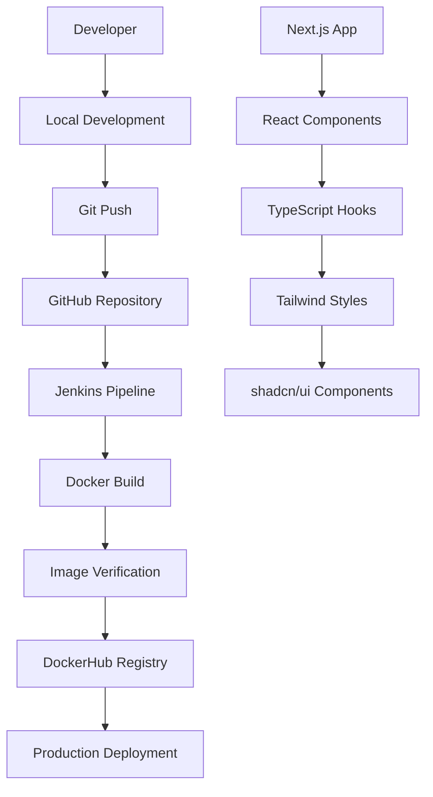

# Proyecto Poli - Generador de Contraseñas Seguras

Una aplicación web moderna desarrollada con **Next.js 14** para generar contraseñas seguras y evaluar su fortaleza en tiempo real. Este proyecto incluye un pipeline completo de **CI/CD con Jenkins** y **Docker** para demostrar las mejores prácticas de desarrollo y despliegue.

[](https://hub.docker.com/r/dennismorato/generador-claves)
[](LICENSE)
[](https://nextjs.org/)
[](https://www.typescriptlang.org/)

## 📋 Tabla de Contenidos

- [🚀 Características](#-características)
- [🏗️ Arquitectura del Proyecto](#️-arquitectura-del-proyecto)
- [📁 Estructura del Proyecto](#-estructura-del-proyecto)
- [🛠️ Tecnologías Utilizadas](#️-tecnologías-utilizadas)
- [⚡ Instalación y Configuración](#-instalación-y-configuración)
- [🐳 Docker](#-docker)
- [🔄 CI/CD con Jenkins](#-cicd-con-jenkins)
- [🌐 Uso de la Aplicación](#-uso-de-la-aplicación)
- [📚 API y Componentes](#-api-y-componentes)
- [🧪 Testing](#-testing)
- [📖 Documentación Adicional](#-documentación-adicional)
- [🤝 Contribución](#-contribución)
- [📄 Licencia](#-licencia)

## 🚀 Características

### Funcionalidades Principales
- ✅ **Generador de contraseñas** con opciones personalizables
- ✅ **Validador de fortaleza** en tiempo real con algoritmo avanzado
- ✅ **Historial de contraseñas** generadas (almacenado localmente)
- ✅ **Soporte multiidioma** (Español/Inglés)
- ✅ **Modo oscuro/claro** con persistencia
- ✅ **Diseño responsive** para móviles y escritorio
- ✅ **Interfaz moderna** con efectos visuales y animaciones

### Características Técnicas
- ✅ **Next.js 14** con App Router
- ✅ **TypeScript** para type safety
- ✅ **Tailwind CSS** para estilos
- ✅ **shadcn/ui** para componentes
- ✅ **Docker** multi-stage build optimizado
- ✅ **CI/CD Pipeline** con Jenkins
- ✅ **Versionado semántico** automático
- ✅ **PWA Ready** con manifest y service worker
- ✅ **SEO optimizado** con metadata completa

## 🏗️ Arquitectura del Proyecto



## 📁 Estructura del Proyecto

```plaintext
Proyecto-POLI-Generador-de-Claves/
├── 📁 app/                          # Next.js App Router
│   ├── globals.css                  # Estilos globales
│   ├── layout.tsx                   # Layout principal
│   └── page.tsx                     # Página principal
├── 📁 components/                   # Componentes React
│   ├── ui/                          # Componentes shadcn/ui
│   ├── app-header.tsx               # Header de la aplicación
│   ├── client-providers.tsx         # Providers del cliente
│   ├── language-selector.tsx        # Selector de idioma
│   ├── password-generator.tsx       # Componente principal
│   └── theme-toggle.tsx             # Toggle de tema
├── 📁 contexts/                     # Contextos React
│   ├── app-context.tsx              # Estado global de la app
│   └── translation-context.tsx      # Sistema de traducciones
├── 📁 hooks/                        # Custom hooks
│   ├── use-password-generator.ts    # Lógica del generador
│   └── use-translation.ts           # Hook de traducciones
├── 📁 lib/                          # Utilidades
│   └── utils.ts                     # Funciones utilitarias
├── 📁 locales/                      # Archivos de traducción
│   ├── en/common.json               # Traducciones en inglés
│   └── es/common.json               # Traducciones en español
├── 📁 public/                       # Archivos estáticos
│   ├── manifest.json                # PWA manifest
│   ├── robots.txt                   # SEO robots
│   └── sitemap.xml                  # SEO sitemap
├── 📁 scripts/                      # Scripts de automatización
│   ├── release.sh                   # Script de release
├── Dockerfile                       # Configuración Docker
├── docker-compose.yml               # Orquestación Docker
├── Jenkinsfile                      # Pipeline CI/CD
├── next.config.mjs                  # Configuración Next.js
├── tailwind.config.js               # Configuración Tailwind
├── package.json                     # Dependencias y scripts
└── README.md                        # Documentación
```

## 🛠️ Tecnologías Utilizadas

### Frontend

- **[Next.js 14](https://nextjs.org/)** - Framework React con App Router
- **[TypeScript](https://www.typescriptlang.org/)** - Tipado estático
- **[React 18](https://reactjs.org/)** - Biblioteca de UI
- **[Tailwind CSS](https://tailwindcss.com/)** - Framework de CSS
- **[shadcn/ui](https://ui.shadcn.com/)** - Componentes de UI
- **[Lucide React](https://lucide.dev/)** - Iconos
- **[next-themes](https://github.com/pacocoursey/next-themes)** - Gestión de temas


### DevOps y Herramientas

- **[Docker](https://www.docker.com/)** - Containerización
- **[Jenkins](https://www.jenkins.io/)** - CI/CD Pipeline
- **[Yarn 4](https://yarnpkg.com/)** - Gestor de paquetes
- **[ESLint](https://eslint.org/)** - Linting de código
- **[Prettier](https://prettier.io/)** - Formateo de código


### Infraestructura

- **[DockerHub](https://hub.docker.com/)** - Registry de imágenes
- **[Nginx](https://nginx.org/)** - Proxy reverso (opcional)
- **[Node.js 20 LTS](https://nodejs.org/)** - Runtime de JavaScript


## ⚡ Instalación y Configuración

### Prerrequisitos

- **Node.js 20 LTS** o superior
- **Yarn 4.x** (se configura automáticamente)
- **Docker** (opcional, para containerización)
- **Git** para control de versiones


### 1. Clonar el Repositorio

```shellscript
git clone git@github.com:Eziuz/Proyecto-POLI-Generador-de-Claves.git
cd Proyecto-POLI-Generador-de-Claves
```

### 2. Configurar Yarn 4

```shellscript
# Habilitar corepack (incluido con Node.js 16+)
corepack enable

# O usar el script automatizado
chmod +x scripts/setup-yarn.sh
./scripts/setup-yarn.sh
```

### 3. Instalar Dependencias

```shellscript
yarn install
```

### 4. Ejecutar en Desarrollo

```shellscript
# Iniciar servidor de desarrollo
yarn dev

# La aplicación estará disponible en http://localhost:3000
```

### 5. Scripts Disponibles

```shellscript
# Desarrollo
yarn dev              # Servidor de desarrollo
yarn build            # Build de producción
yarn start            # Servidor de producción
yarn lint             # Linting del código
yarn type-check       # Verificación de tipos TypeScript
```

## 🐳 Docker

### Construcción Local

```shellscript
# Construir imagen Docker
docker build -t generador-claves:latest .

# O usar el script automatizado
chmod +x scripts/build.sh
./scripts/build.sh latest
```

### Ejecutar Contenedor

```shellscript
# Ejecutar contenedor
docker run -d -p 3000:3000 --name generador-claves generador-claves:latest

# O usar el script automatizado
chmod +x scripts/run-docker.sh
./scripts/run-docker.sh latest 3000
```

### Docker Compose

```shellscript
# Ejecutar con Docker Compose
docker-compose up -d

# Con Nginx (perfil de producción)
docker-compose --profile production up -d
```

### Usar Imagen de DockerHub

```shellscript
# Descargar y ejecutar imagen oficial
docker run -d -p 3000:3000 dennismorato/generador-claves:latest

# Versiones específicas disponibles
docker run -d -p 3000:3000 dennismorato/generador-claves:1.0.0

# Con variables de entorno personalizadas
docker run -d -p 8080:3000 \
  -e PORT=3000 \
  -e NODE_ENV=production \
  --name securepass \
  dennismorato/generador-claves:latest
```

### Etiquetas Disponibles

- `latest` - Última versión estable
- `1.x.x` - Versiones específicas con versionado semántico
- `dev` - Versión de desarrollo (inestable)


## 🔄 CI/CD con Jenkins

### Configuración del Pipeline

El proyecto incluye un **Jenkinsfile** completo que implementa:

1. **Checkout** del código fuente
2. **Determinación de versión** (semántica)
3. **Build** de imagen Docker
4. **Verificación** de la imagen
5. **Push** a DockerHub (`dennismorato/generador-claves`)
6. **Limpieza** de recursos


### Versionado Semántico

```shellscript
# Crear release patch (1.0.0 → 1.0.1)
chmod +x scripts/release.sh
./scripts/release.sh patch "Fix security vulnerabilities"

# Crear release minor (1.0.1 → 1.1.0)
./scripts/release.sh minor "Add new features"

# Crear release major (1.1.0 → 2.0.0)
./scripts/release.sh major "Breaking changes"
```

### Configuración de Credenciales

En Jenkins, configurar las siguientes credenciales:

- **ID**: `dockerhub-credentials`
- **Tipo**: Username with password
- **Username**: `dennismorato`
- **Password**: Token de DockerHub


### Etiquetas de Imagen

El pipeline genera automáticamente:

- `dennismorato/generador-claves:latest` (solo para releases oficiales)
- `dennismorato/generador-claves:1.0.0` (versión semántica)
- `dennismorato/generador-claves:abc1234` (hash del commit)
- `dennismorato/generador-claves:1.0.0-build.5` (builds de desarrollo)


## 🌐 Uso de la Aplicación

### Generador de Contraseñas

1. **Configurar opciones**:

1. Longitud (4-50 caracteres)
2. Incluir mayúsculas (A-Z)
3. Incluir minúsculas (a-z)
4. Incluir números (0-9)
5. Incluir símbolos (!@#$...)


2. **Generar contraseña**:

1. Clic en "Generar Contraseña"
2. La contraseña aparece con evaluación de fortaleza
3. Copiar al portapapeles con un clic


### Validador de Contraseñas

1. **Evaluar contraseña existente**:

1. Introducir contraseña en el campo
2. Ver evaluación en tiempo real
3. Recibir sugerencias de mejora


### Historial

- **Ver historial**: Clic en "Mostrar"
- **Copiar contraseña**: Clic en el icono de copia
- **Limpiar historial**: Clic en el icono de papelera


### Configuración

- **Cambiar idioma**: Selector en el header
- **Cambiar tema**: Toggle en el header
- **Configuración persistente**: Se guarda automáticamente


## 📚 API y Componentes

### Hooks Principales

#### `usePasswordGenerator`

```typescript
const {
  password,           // Contraseña generada
  options,           // Opciones de generación
  setOptions,        // Actualizar opciones
  generatePassword,  // Generar nueva contraseña
  evaluateStrength   // Evaluar fortaleza
} = usePasswordGenerator()
```

#### `useTranslation`

```typescript
const {
  t,                 // Función de traducción
  currentLanguage,   // Idioma actual
  changeLanguage,    // Cambiar idioma
  isLoading         // Estado de carga
} = useTranslation()
```

### Componentes Principales

- **`PasswordGenerator`**: Componente principal
- **`AppHeader`**: Header con controles
- **`LanguageSelector`**: Selector de idioma
- **`ThemeToggle`**: Toggle de tema


### Algoritmo de Evaluación

La fortaleza se evalúa basándose en:

- Longitud mínima (8+ caracteres)
- Longitud recomendada (12+ caracteres)
- Presencia de minúsculas
- Presencia de mayúsculas
- Presencia de números
- Presencia de símbolos
- Longitud extendida (16+ caracteres)


**Puntuación**: 0-6 puntos (Muy débil → Excelente)

## 🧪 Testing

### Pruebas Locales

```shellscript
# Verificar tipos TypeScript
yarn type-check

# Linting del código
yarn lint

# Build de producción (prueba de compilación)
yarn build
```

### Pruebas Docker

```shellscript
# Verificar imagen Docker
docker run --rm dennismorato/generador-claves:latest node --version

# Prueba de salud
curl -f http://localhost:3000 || echo "Health check failed"

# Verificar logs del contenedor
docker logs generador-claves
```

## 📖 Documentación Adicional

### Variables de Entorno

| Variable | Descripción | Valor por defecto
|-----|-----|-----
| `NODE_ENV` | Entorno de ejecución | `production`
| `PORT` | Puerto de la aplicación | `3000`
| `HOSTNAME` | Hostname del servidor | `0.0.0.0`
| `NEXT_TELEMETRY_DISABLED` | Deshabilitar telemetría | `1`


### Configuración de Producción

Para producción, considera:

- Usar **HTTPS** con certificados SSL
- Configurar **Nginx** como proxy reverso
- Implementar **rate limiting**
- Configurar **monitoreo** y logs
- Usar **secrets** para credenciales


### Optimizaciones

- **Imágenes Docker** multi-stage optimizadas
- **Bundle splitting** automático con Next.js
- **Tree shaking** para reducir tamaño
- **Compresión gzip** en Nginx
- **Caché** de assets estáticos


## 🤝 Contribución

### Proceso de Contribución

1. **Fork** el repositorio
2. **Crear** una rama feature (`git checkout -b feature/nueva-funcionalidad`)
3. **Commit** los cambios (`git commit -am 'Add nueva funcionalidad'`)
4. **Push** a la rama (`git push origin feature/nueva-funcionalidad`)
5. **Crear** un Pull Request


### Estándares de Código

- Usar **TypeScript** para todo el código
- Seguir las reglas de **ESLint**
- Escribir **commits semánticos**
- Documentar **funciones complejas**
- Mantener **cobertura de tests**


### Reportar Issues

Al reportar un issue, incluir:

- **Descripción** clara del problema
- **Pasos** para reproducir
- **Comportamiento esperado**
- **Screenshots** si aplica
- **Información del entorno**


## 📄 Licencia

Este proyecto está licenciado bajo la **Licencia MIT**. Ver el archivo [LICENSE](LICENSE) para más detalles.

---

## 🎯 Laboratorio de CI/CD

Este proyecto fue desarrollado como parte de un **laboratorio de integración continua** que demuestra:

- ✅ **Configuración de Jenkins** con Docker
- ✅ **Pipeline automatizado** con múltiples stages
- ✅ **Versionado semántico** automático
- ✅ **Integración con DockerHub**
- ✅ **Mejores prácticas** de DevOps
- ✅ **Aplicación real** con funcionalidad completa


### Objetivos Alcanzados

1. **Automatización completa** del proceso de build y deploy
2. **Gestión de versiones** profesional
3. **Containerización** optimizada
4. **Seguridad** en el manejo de credenciales
5. **Limpieza automática** de recursos
6. **Documentación completa** del proceso


### Comandos de Ejemplo

```shellscript
# Descargar y ejecutar la aplicación
docker pull dennismorato/generador-claves:latest
docker run -d -p 3000:3000 dennismorato/generador-claves:latest

# Acceder a la aplicación
open http://localhost:3000
```
